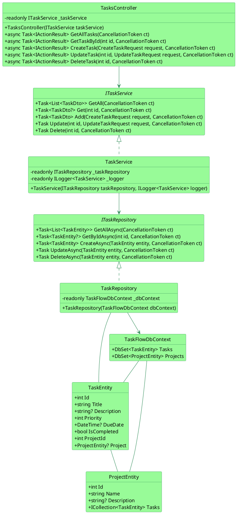

# TaskFlowAPI: Current State Analysis

## 1. Overview

The initial state of the TaskFlowAPI project is a minimal ASP.NET Core Web API with a basic structure. It includes a single controller, a service interface, and placeholder implementations for the repository and service layers. The project is intentionally left incomplete to serve as a starting point for the 23-week clean code curriculum.

## 2. Key Components

*   **`TasksController`:** The entry point for API requests related to tasks. It handles HTTP GET, POST, PUT, and DELETE requests. The initial implementation has poor naming and is not fully implemented.
*   **`ITaskService`:** The interface that defines the contract for the task service. It includes methods for getting, adding, updating, and deleting tasks.
*   **`TaskService`:** The initial implementation of `ITaskService`. The methods in this class throw `NotImplementedException`, as the business logic is to be implemented by the students.
*   **`ITaskRepository`:** The interface that defines the contract for the task repository.
*   **`TaskRepository`:** The initial implementation of `ITaskRepository`. The methods in this class throw `NotImplementedException`, as the data access logic is to be implemented by the students.
*   **`TaskEntity` and `ProjectEntity`:** The database entities that map to the `Tasks` and `Projects` tables.
*   **`TaskFlowDbContext`:** The Entity Framework Core `DbContext` for interacting with the database.
*   **`Program.cs`:** The main entry point of the application, where services are configured and the application is launched.

## 3. Architecture

The initial architecture follows a basic N-tier pattern, with a clear separation of concerns between the controller, service, and repository layers. However, the implementation is incomplete, and the focus of the initial weeks is on improving the code quality and implementing the core functionality.

## 4. UML Diagram (Initial State)

The following UML diagram illustrates the initial structure of the TaskFlowAPI project.

