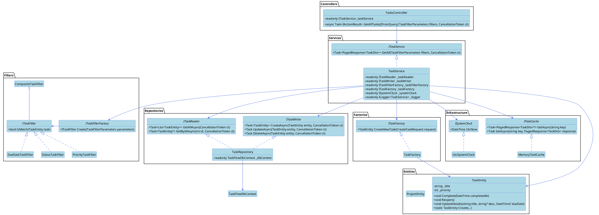

# TaskFlowAPI: Future State Analysis

## 1. Overview

After 23 weeks of development and refactoring, the TaskFlowAPI project will be a well-structured, feature-rich, and maintainable application. It will incorporate best practices for clean code, SOLID principles, design patterns, and API design. The final application will be a testament to the student's learning journey and their ability to apply the concepts learned throughout the course.

## 2. Key Enhancements

The final version of the TaskFlowAPI will include the following enhancements:

*   **Meaningful Naming and Comments:** All names will be intention-revealing, and comments will be used sparingly to explain the "why" behind the code.
*   **SOLID Principles:** The application will adhere to the SOLID principles, resulting in a more modular, flexible, and maintainable codebase.
*   **Rich Domain Model:** The `TaskEntity` will be a rich domain object with encapsulated business logic, including methods for completing, reopening, and updating tasks.
*   **Repository and Service Layers:** The repository and service layers will be fully implemented, with clear separation of concerns.
*   **Error Handling and Validation:** The application will have robust error handling and validation, using custom exceptions and FluentValidation.
*   **Filtering and Pagination:** The API will support filtering tasks by status, priority, and due date, as well as pagination for large result sets.
*   **Unit Testing and TDD:** The application will have a comprehensive suite of unit tests, with a focus on TDD for new features.
*   **Design Patterns:** The application will use design patterns such as the Factory and Strategy patterns to solve common design problems.
*   **API Design:** The API will be well-documented with Swagger, versioned, and will follow RESTful best practices.
*   **Performance:** The application will include performance optimizations such as caching and response compression.

## 3. Architecture

The final architecture will be a more refined version of the initial N-tier architecture, with a clear separation of concerns and a focus on dependency inversion. The application will be composed of small, focused components that are easy to test and maintain.

## 4. UML Diagram (Future State)

The following UML diagram illustrates the final structure of the TaskFlowAPI project.

