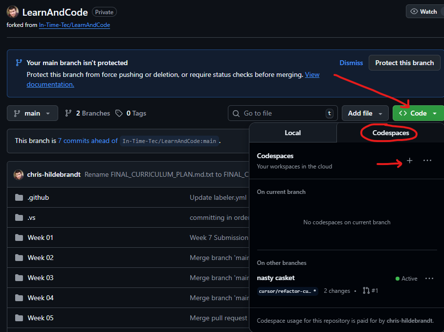

# Week 1: Introduction & Quality Manifesto

Welcome to week 1. This week, we will be introducing you to the importance of clean code and how it aligns with In Time Tec's Quality Manifesto. The Quality Manifesto outlines 9 foundational values that guide software delivery at In Time Tec. These principles define what "done" means in a professional context and will be the focus of every refactoring and discussion throughout this course. Our focus will be on customer-centric design and a writing clean code can contribute to better solutions. It is expected that you will have completed everything on this page prior to our meeting.

## 1. Learning Objectives

- Internalize In Time Tec’s Quality Manifesto principles and how they translate to `TaskFlow` API work.
- Understand the importance of clean code and its relationship to customer-centric design.
- Stand up the repository locally.
- Map the 21-week milestones to the `TaskFlow` API architecture.
- Identify escalation paths when blocked more than 30 minutes.

## 2. Reading & Resources (45 min)

- **`README.md`** (read the entire document).
- **In Time Tec Quality Manifesto** (Review the entire document).
- **Clean Code – Chapter 1: Clean Code (pp. 1-14)**.
  - Focus on the definition of clean code, professional responsibility, and the “Boy Scout Rule.”
  - Summary: Professional developers keep the codebase cleaner with every touch. Quality is non-negotiable, and messy code is a liability to partners.

## 3. This Week’s Work

- Fork and clone the repository.
- Run the `TaskFlow` API locally and explore Swagger.
- Review repository structure, intentional smells, and weekly docs overview.

## 4. Files to Modify

- This file (`Course-Materials/Weekly-Modules/week-01-introduction.md`) – append your journal and discussion prompt responses.
- `WEEKLY_PROGRESS.md`
- No code changes yet—this week is orientation. But it is recommended that you browse the repo to get familiar with the project layout and folder structure.

## 5. Step-by-Step Instructions

1. Fork the repo on GitHub. Clone your fork locally (`git clone ...`). (Alternatively you may use Github Codespaces for your IDE) 
2. Follow `SETUP.md` exactly. Stop and document any blockers.
3. Run `dotnet run` inside `TaskFlowAPI/` and verify Swagger at `https://localhost:5001/swagger`.
4. Run `dotnet test TaskFlowAPI.sln` from the repo root. Confirm only skipped tests.
5. Read this week's reading assignments.
6. **NEW:** Complete Code Smell Scavenger Hunt (see Section 11 below) - 30 minutes
7. Read and fill out the `Journal` section of this document, make notes from your learning in the `Discussion Prep` section.
8. Check off Week 1 in `WEEKLY_PROGRESS.md` once everything above is done.

## 6. How to Test

```bash
dotnet build TaskFlowAPI.sln
dotnet test TaskFlowAPI.sln
```

## 7. Success Criteria

- Repository forks successfully and builds locally.
- Swagger UI reachable and shows `TaskFlow` endpoints.
- `dotnet test` executes with two skipped tests and zero failures.
- Escalation plan documented in this file.
- Week 1 checkbox ticked in `WEEKLY_PROGRESS.md`.

## 8. Submission Process

1. Create branch `week-01/<your-name>`.
2. Commit changes with message `Week 01 – environment ready`.
3. Open PR using `.github/pull_request_template.md`.
4. Create issue using `.github/ISSUE_TEMPLATE/weekly-submission.md` and link your PR.

## 9. Journal and Discussion Prep

(Use this section as a journal of your learning. Answer the questions below after completing the reading and assignment. ALSO record any questions or comments you would like to bring up during this week's discussion.)

### Journal:

**After completing Code Smell Scavenger Hunt:**

1. **Customer Impact Example:** 
   You found the abbreviation `svc` in TasksController. Imagine a new teammate needs to add a feature to create bulk tasks. Walk through their confusion:
   - What questions will they ask about `svc`?
   - How many minutes might they waste?
   - How does this delay = increased cost to customer?
   - Your answer: [150 words]

2. **Bug Risk Example:**
   The `GenerateProjectSummaryReport` method has 100+ lines. 
   - If a bug exists in "calculate percentage" logic, how hard is it to find?
   - How many OTHER things might break when you fix it?
   - Your answer: [100 words]

3. **Your Biggest Aha:**
   What surprised you most about the codebase smell? [50 words]

4. **Manifesto Connection:**
   - How does a lack of clean code (e.g., poor organization, missing tests) directly harm the value of Customer Centric Design?
   - Which Manifesto value do you think will be the most challenging for you to implement and why?

### Discussion Prep:
- *What did you learn about the curriculum structure?*
- *Where do you expect to struggle?*
- *What’s your plan when blocked longer than 30 minutes?*

## 10. Time Estimate

- 45 min – Read `README.md` + Quality Manifesto + Clean Code chapter.
- 15 min – Architecture Overview (Section 11) - Review diagrams
- 10 min – Fork + clone repo.
- 10 min – Environment setup + build/test verification.
- 30 min – Code Smell Scavenger Hunt (Section 12)
- 20 min – Journal + discussion prep (updated questions)
- 10 min – Create PR/issue.
**Total:** ~2 hours 20 minutes.

## 11. Architecture Overview (NEW)

**Goal:** Understand the TaskFlowAPI structure before diving into code

**Time:** 15 minutes

### Visual Architecture Reference

Before exploring the codebase, review these architecture diagrams to understand the big picture:

1. **Current State Class Diagram** - Shows the initial structure (Weeks 1-8)
   - See: `Course-Materials/Project-Documentation/TaskFlowAPI_Current_State.md` (Section 4.1)
   - Or: `docs/architecture-diagrams.md` (Section 1)

2. **Future State Class Diagram** - Shows the target architecture (Week 23)
   - See: `Course-Materials/Project-Documentation/TaskFlowAPI_Future_State.md` (Section 4.1)
   - Or: `docs/architecture-diagrams.md` (Section 2)

3. **Data Flow Diagram** - Shows how requests flow through the system
   - See: `docs/architecture-diagrams.md` (Section 3)

4. **Component Diagram** - Shows high-level components and dependencies
   - See: `docs/architecture-diagrams.md` (Section 5)

5. **Architecture Evolution Timeline** - Shows how the architecture evolves over 23 weeks
   - See: `docs/architecture-diagrams.md` (Section 6)

### Key Architecture Concepts

**Layered Architecture:**
- **Controllers** - Handle HTTP requests/responses
- **Services** - Business logic and orchestration
- **Repositories** - Data access abstraction
- **Entities** - Domain models (database tables)

**Design Patterns You'll Learn:**
- Repository Pattern (Week 8)
- Strategy Pattern (Week 12 - Filters)
- Factory Pattern (Week 19)
- CQRS Pattern (Week 20 - Reader/Writer separation)

**SOLID Principles:**
- Single Responsibility (Week 11)
- Open/Closed (Week 12)
- Liskov Substitution (Week 13)
- Interface Segregation (Week 14)
- Dependency Inversion (Week 15)

### Your Task

1. Open `docs/architecture-diagrams.md`
2. Review the Current State Class Diagram
3. Compare it to the Future State Class Diagram
4. Note the differences - these are what you'll build over 23 weeks!

**Questions to Consider:**
- What patterns do you recognize?
- What's missing in the current state?
- How does the architecture support testability?

---

## 12. Code Smell Scavenger Hunt (NEW)

**Goal:** Build a mental inventory of "code smells" you'll fix over 23 weeks.

**Time:** 30 minutes

**Instructions:**
1. Create `docs/week-01-codebase-inventory.md` in your fork
2. Open the following files and hunt for specific smells:

### Part A: Naming Violations

**Search:** `TaskFlowAPI/Controllers/TasksController.cs` and `TaskFlowAPI/Controllers/ReportsController.cs`

Find and document:
- **Abbreviations:** Any shortened names (e.g., `svc`, `dt`, `rpt`)
- **Single letters:** Variable names like `t`, `s`, `i` (outside of loop iterators)
- **Non-descriptive names:** Methods named `Get()`, `Add()`, `Generate()` without context

| File | Line # (approx) | Bad Name | Category | Why It's Bad |
|------|-----------------|----------|----------|--------------|
| TasksController.cs | ~15 | `svc` | Abbreviation | Mental mapping required to understand "service" |
| ReportsController.cs | ~35 | `t` | Single letter | Could be "task", "total", "temp" - ambiguous |
| (add your findings) | | | | |

### Part B: Function Smells

**Search:** `TaskFlowAPI/Controllers/ReportsController.cs` - the `GenerateProjectSummaryReport` method

Identify:
- **Line count:** How many lines is this method? ______
- **Abstraction levels:** Count how many DIFFERENT things it does (e.g., fetch data, filter, calculate, format)  
  List them:
  1. _______________
  2. _______________
  3. _______________
  4. _______________
  
- **Nesting depth:** Deepest indentation level (how many tabs/spaces)? ______
- **Comments as code smell:** Any comment explaining WHAT code does (not WHY)? Quote one: _______________

### Part C: Class & Structure Smells

**Search:** `TaskFlowAPI/Entities/TaskEntity.cs`

Document:
- **Public setters:** Count properties with public `set` - these will be encapsulated in Week 7
  - Total count: ______
  - Which ones seem risky (could be set to invalid values)? _______________

**Search:** `TaskFlowAPI/Services/Tasks/TaskService.cs`

Document:
- **Method count:** How many public methods? ______ (Will refactor in Week 11 if >7)
- **Responsibility count:** How many different JOBS does this class have? (e.g., CRUD, validation, mapping)
  List them: _______________

### Part D: Pattern Recognition (No Code Reading Required)

**Search:** File/folder structure in Solution Explorer

Missing patterns (you'll add these):
- Week 8: `Repositories/` folder exists?  ______
- Week 9: `DTOs/` folder exists? ______
- Week 12: `Filters/` folder exists? ______
- Week 17: `Tests/Unit/` folder exists? ______

### Part E: Your Predictions

Based on your scavenger hunt, predict:

1. **Hardest Week:** Which week (1-23) will be most challenging based on smells you found?
   - Your prediction: Week ______ because _______________

2. **Biggest Win:** Which refactoring will have the most impact?
   - Your prediction: _______________

3. **Question for Discussion:** One thing you're curious about from the codebase: _______________

**Deliverable:** Commit `docs/week-01-codebase-inventory.md` with your completed scavenger hunt before Week 1 PR.

**Why This Matters:**
- You'll reference this inventory in Weeks 2-4 when fixing these specific smells
- Builds pattern recognition before you start coding
- Creates concrete examples for abstract journal questions
- Gives you ownership of the refactoring journey (you discovered the problems!)

---

## 13. Additional Resources

- **[Architecture Diagrams](../../../docs/architecture-diagrams.md)** - Complete visual reference for TaskFlowAPI architecture
- **[TaskFlowAPI Current State](../Project-Documentation/TaskFlowAPI_Current_State.md)** - Detailed current state analysis
- **[TaskFlowAPI Future State](../Project-Documentation/TaskFlowAPI_Future_State.md)** - Target architecture vision

---

## 14. Getting Help

(please fill in the blanks)
- Team chat `#_____` for quick questions.
- Mentor: `_____`.
- Schedule 1:1 with mentor or L&C leadership if still blocked after chat/office hours.