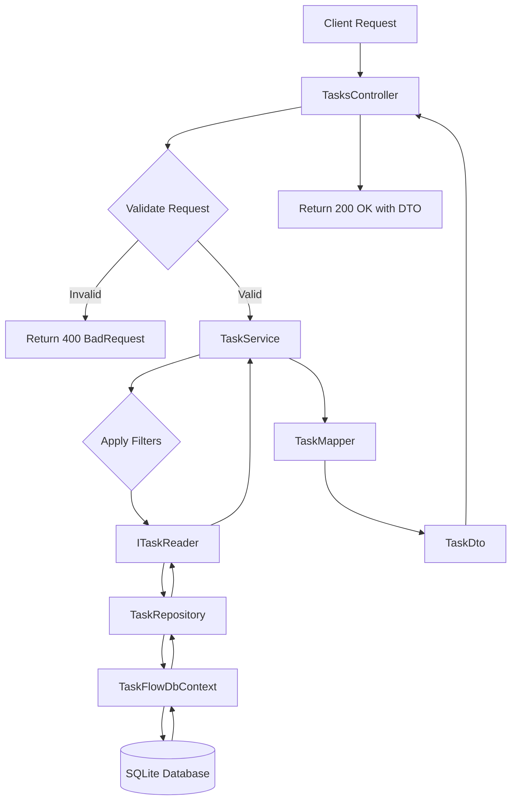
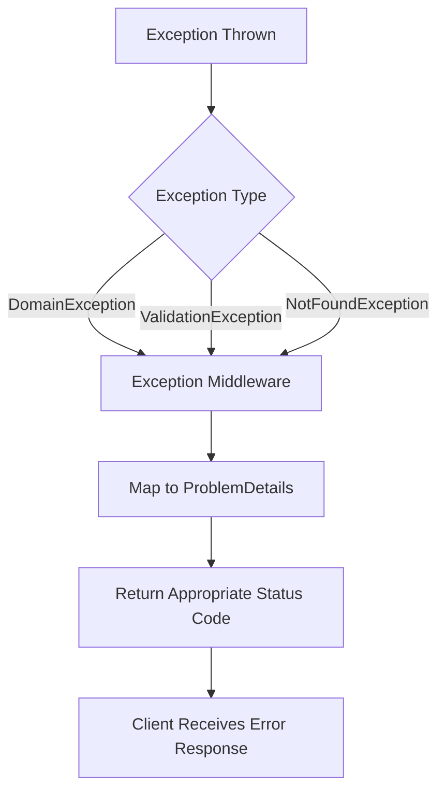
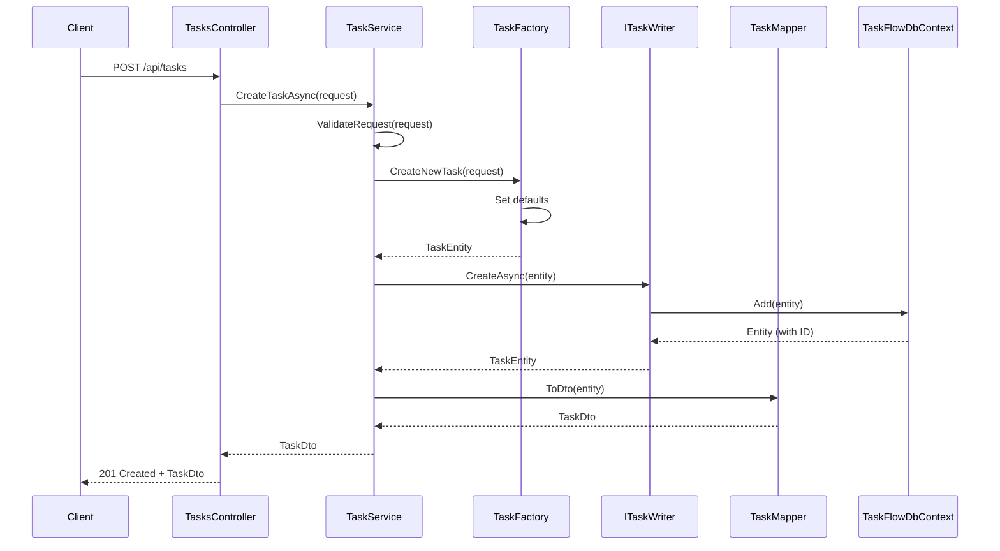
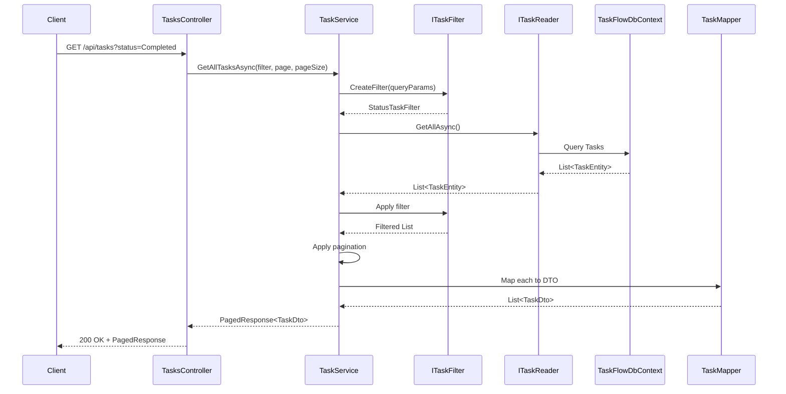
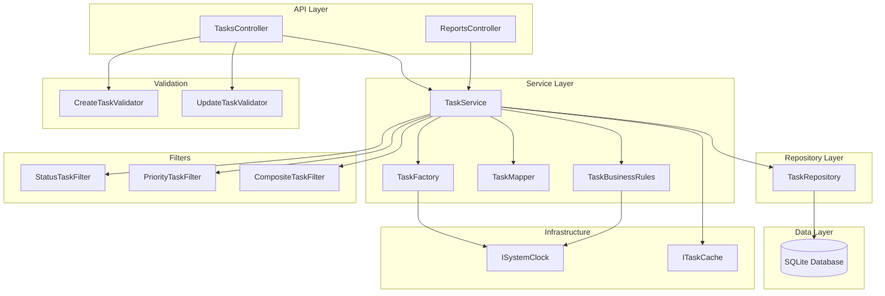
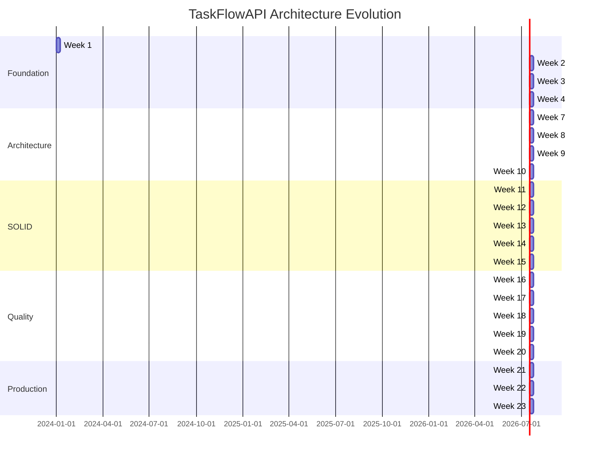
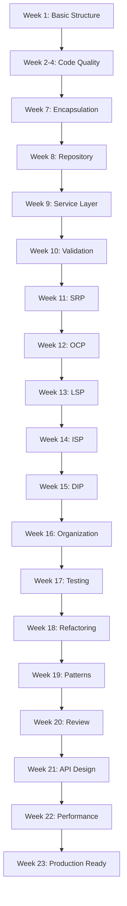

# Architecture Diagrams - Detailed Implementation Guide

**Purpose:** Create comprehensive visual diagrams (Mermaid UML) showing TaskFlowAPI's architecture to help students understand the codebase structure and evolution.

**Estimated Effort:** 6-8 hours  
**Priority:** High

---

## Diagram Types to Create

### 1. Current State Class Diagram (Mermaid UML)
**Purpose:** Show current architecture with all classes, interfaces, and relationships  
**File:** `docs/architecture/current-state-class-diagram.md`  
**Time:** 2 hours

### 2. Future State Class Diagram (Mermaid UML)
**Purpose:** Show architecture after all 23 weeks (complete, production-ready)  
**File:** `docs/architecture/future-state-class-diagram.md`  
**Time:** 2 hours

### 3. Data Flow Diagram (Mermaid Flowchart)
**Purpose:** Show request/response flows through the system  
**File:** `docs/architecture/data-flow-diagram.md`  
**Time:** 1 hour

### 4. Sequence Diagrams (Mermaid Sequence)
**Purpose:** Show detailed component interactions for key operations  
**File:** `docs/architecture/sequence-diagrams.md`  
**Time:** 1 hour

### 5. Component Interaction Diagram (Mermaid Graph)
**Purpose:** Show high-level component relationships and DI flow  
**File:** `docs/architecture/component-diagram.md`  
**Time:** 1 hour

### 6. Architecture Evolution Timeline (Mermaid Gantt/Flowchart)
**Purpose:** Show how architecture changes week by week  
**File:** `docs/architecture/evolution-timeline.md`  
**Time:** 1 hour

---

## Diagram 1: Current State Class Diagram

### Mermaid Structure

```mermaid
classDiagram
    %% Controllers Layer
    class TasksController {
        -ITaskService _taskService
        +GetAllTasksAsync()
        +GetTaskByIdAsync()
        +CreateTaskAsync()
        +UpdateTaskAsync()
        +DeleteTaskAsync()
    }
    
    class ReportsController {
        -ITaskService _taskService
        +GenerateProjectSummaryReport()
    }
    
    %% Services Layer
    class ITaskService {
        <<interface>>
        +GetAllTasksAsync()
        +GetTaskByIdAsync()
        +CreateTaskAsync()
        +UpdateTaskAsync()
        +DeleteTaskAsync()
    }
    
    class TaskService {
        -ITaskReader _taskReader
        -ITaskWriter _taskWriter
        -ITaskFactory _taskFactory
        -ITaskMapper _taskMapper
        -ITaskBusinessRules _businessRules
        -ILogger _logger
        +GetAllTasksAsync()
        +GetTaskByIdAsync()
        +CreateTaskAsync()
    }
    
    class TaskFactory {
        -ISystemClock _clock
        +CreateNewTask()
    }
    
    class TaskMapper {
        +ToDto()
        +ToEntity()
    }
    
    class TaskBusinessRules {
        -ISystemClock _clock
        +IsOverdue()
        +CanComplete()
    }
    
    %% Repository Layer
    class ITaskReader {
        <<interface>>
        +GetAllAsync()
        +GetByIdAsync()
    }
    
    class ITaskWriter {
        <<interface>>
        +CreateAsync()
        +UpdateAsync()
        +DeleteAsync()
    }
    
    class TaskRepository {
        -TaskFlowDbContext _dbContext
        +GetAllAsync()
        +GetByIdAsync()
        +CreateAsync()
        +UpdateAsync()
        +DeleteAsync()
    }
    
    %% Entities
    class TaskEntity {
        -string _title
        +int Id
        +string Title
        +int Priority
        +DateTime? DueDate
        +bool IsCompleted
        +Complete()
        +Reopen()
        +Create()
    }
    
    class ProjectEntity {
        +int Id
        +string Name
        +ICollection~TaskEntity~ Tasks
    }
    
    %% DTOs
    class TaskDto {
        +int Id
        +string Title
        +int Priority
        +DateTime? DueDate
        +bool IsCompleted
    }
    
    class CreateTaskRequest {
        +string? Title
        +int? Priority
        +DateTime? DueDate
    }
    
    class UpdateTaskRequest {
        +string? Title
        +int? Priority
        +bool? IsCompleted
    }
    
    %% Validators
    class CreateTaskValidator {
        +Validate()
    }
    
    class UpdateTaskValidator {
        +Validate()
    }
    
    %% Filters
    class ITaskFilter {
        <<interface>>
        +IsMatch()
    }
    
    class StatusTaskFilter {
        +IsMatch()
    }
    
    class PriorityTaskFilter {
        +IsMatch()
    }
    
    class CompositeTaskFilter {
        +IsMatch()
    }
    
    %% Infrastructure
    class ISystemClock {
        <<interface>>
        +DateTime UtcNow
    }
    
    class UtcSystemClock {
        +DateTime UtcNow
    }
    
    class TaskFlowDbContext {
        +DbSet~TaskEntity~ Tasks
        +DbSet~ProjectEntity~ Projects
    }
    
    %% Relationships
    TasksController --> ITaskService
    ReportsController --> ITaskService
    TaskService ..|> ITaskService
    TaskService --> ITaskReader
    TaskService --> ITaskWriter
    TaskService --> ITaskFactory
    TaskService --> ITaskMapper
    TaskService --> TaskBusinessRules
    TaskRepository ..|> ITaskReader
    TaskRepository ..|> ITaskWriter
    TaskRepository --> TaskFlowDbContext
    TaskFlowDbContext --> TaskEntity
    TaskFlowDbContext --> ProjectEntity
    TaskEntity --> ProjectEntity
    TaskFactory --> ISystemClock
    TaskBusinessRules --> ISystemClock
    UtcSystemClock ..|> ISystemClock
    StatusTaskFilter ..|> ITaskFilter
    PriorityTaskFilter ..|> ITaskFilter
    CompositeTaskFilter --> ITaskFilter
```



### Notes for Diagram
- Use color coding by layer (if Mermaid supports)
- Group related classes
- Show all dependencies
- Include key methods/properties

---

## Diagram 2: Future State Class Diagram

Similar structure but showing:
- All SOLID principles applied
- All design patterns in place
- Complete separation of concerns
- Additional components (caching, etc.)

---

## Diagram 3: Data Flow Diagram

### Request Flow



### Error Flow



---

## Diagram 4: Sequence Diagrams

### Create Task Sequence



### Get All Tasks with Filtering



---

## Diagram 5: Component Interaction Diagram



---

## Diagram 6: Architecture Evolution Timeline



Or use flowchart to show evolution:



---

## Integration into Documentation

### Update TaskFlowAPI/README.md

Add section:
```markdown
## Architecture

For detailed architecture diagrams, see:
- [Current State Class Diagram](docs/architecture/current-state-class-diagram.md)
- [Future State Class Diagram](docs/architecture/future-state-class-diagram.md)
- [Data Flow Diagrams](docs/architecture/data-flow-diagram.md)
- [Sequence Diagrams](docs/architecture/sequence-diagrams.md)
- [Component Diagram](docs/architecture/component-diagram.md)
- [Architecture Evolution](docs/architecture/evolution-timeline.md)
```

### Update Week 1 Module

Add to `week-01-introduction.md`:
```markdown
## Architecture Overview

Before diving into the code, review the architecture diagrams:
- [Current State Architecture](docs/architecture/current-state-class-diagram.md)
- [Architecture Evolution Timeline](docs/architecture/evolution-timeline.md)

These diagrams will help you understand:
- How components relate to each other
- The separation of concerns (Controller → Service → Repository)
- How the architecture evolves over 23 weeks
```

---

## Success Criteria

- [ ] 6+ comprehensive diagrams created
- [ ] All diagrams use Mermaid syntax
- [ ] Diagrams render correctly in GitHub/Markdown
- [ ] Diagrams accurately represent codebase
- [ ] Diagrams integrated into documentation
- [ ] Diagrams referenced in Week 1
- [ ] Diagrams help students understand architecture
- [ ] Both current and future state shown
- [ ] Evolution timeline included

---

## Tips for Creating Diagrams

1. **Start with Current State:** Map what actually exists now
2. **Reference Code:** Look at actual files to ensure accuracy
3. **Keep Updated:** Diagrams should match codebase
4. **Use Consistent Naming:** Match class/method names exactly
5. **Show Relationships:** Dependencies, inheritance, composition
6. **Layer Grouping:** Visually separate layers (Controllers, Services, Data)
7. **Color Coding:** Use colors to distinguish layers (if supported)
8. **Keep It Readable:** Don't overcrowd diagrams
9. **Version Control:** Track diagram changes with code changes
10. **Test Rendering:** Verify diagrams render in GitHub/Markdown viewers
