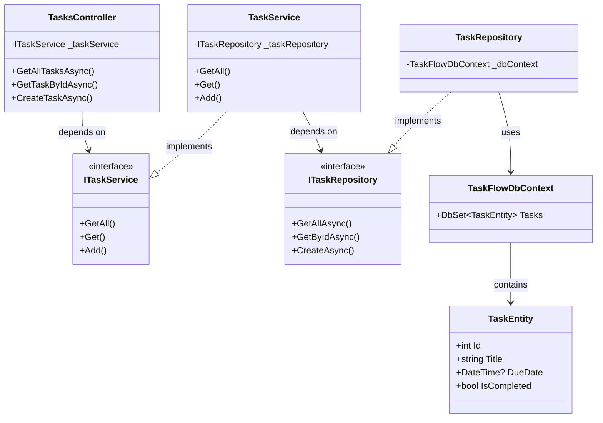
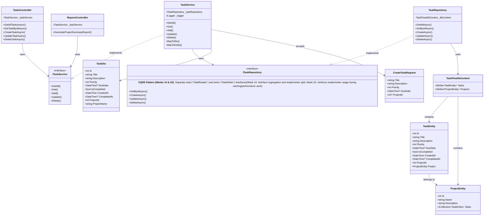
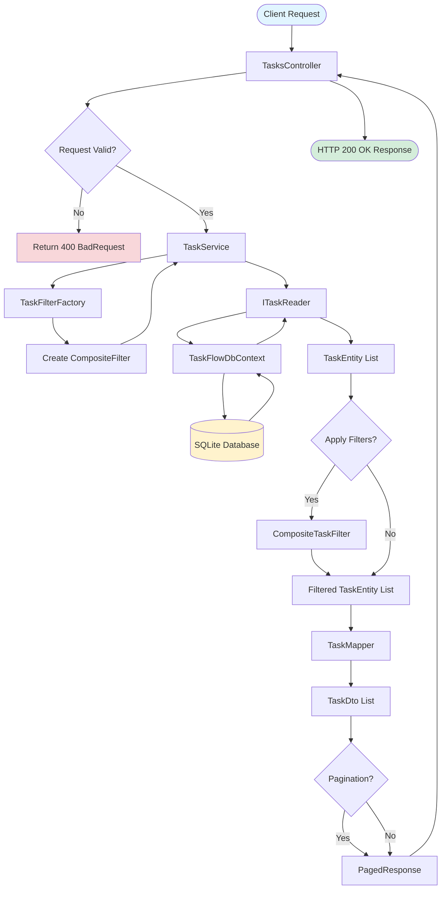
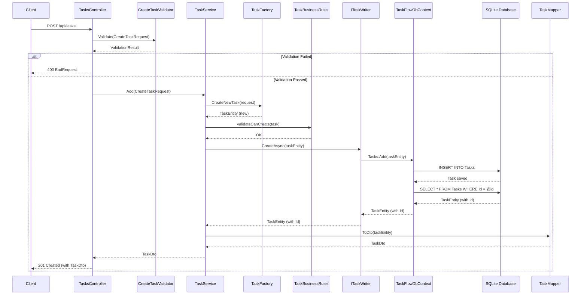
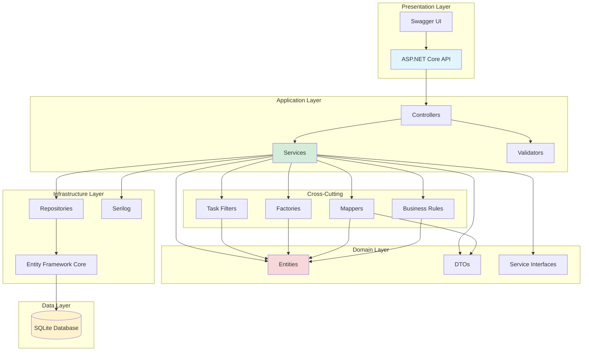
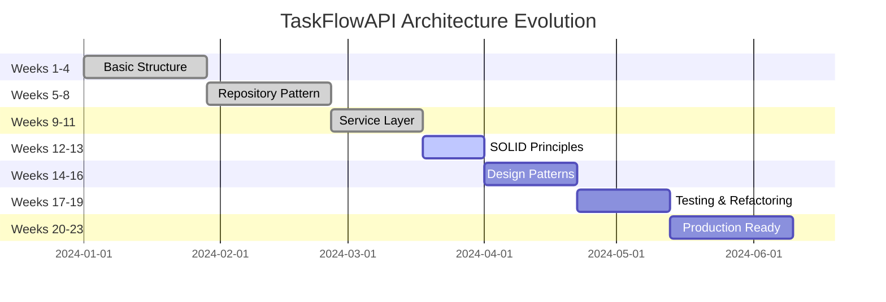

# TaskFlowAPI Architecture Diagrams

This document contains visual diagrams to help understand the TaskFlowAPI architecture at different stages of development.

---

## 0. Week 1 Simplified Architecture (Essential View)

**For junior developers in Week 1:** This simplified diagram shows only the core components you need to understand.

### Understanding This Diagram

**Three Key Layers:**
- **Controllers** (top) - Receives HTTP requests from clients
- **Services** (middle) - Contains business logic  
- **Repositories** (bottom) - Handles data access to the database

**Why Dependencies Flow Downward:**
- Controllers ask Services to do work
- Services ask Repositories to fetch/store data
- Controllers DON'T talk directly to Repositories (good design!)

### Questions to Ponder

As you explore the codebase, think about:
1. Why does `TasksController` depend on `ITaskService` instead of `TaskService` directly?
2. What is the purpose of the `ITaskRepository` interface?
3. Why is there a `TaskFlowDbContext` separate from the `TaskRepository`?
4. If you wanted to add a new method to get tasks by priority, which layer(s) would you modify?

---

## Diagram Legend & Annotations

### Diagram Symbols

| Symbol | Meaning | Example |
|--------|---------|---------|
| **-->** | "depends on" / "uses" | Controller → Service (controller uses service) |
| **..\|\>** | "implements" | Service ..\|\> IService (service implements interface) |
| **<<interface>>** | Interface type | ITaskService is a contract/interface |
| **\-** (private field) | Hidden from external code | \-_taskService (only this class uses it) |
| **\+** (public method) | Available to external code | \+GetAllAsync() (other code can call this) |

### Layer Responsibilities

**Controllers Layer** - HTTP Entry Points
- Receives HTTP requests from clients
- Validates request format
- Calls services to do work
- Returns HTTP responses (200 OK, 400 Bad Request, etc.)
- **Code Smell Alert:** Controllers should be THIN (10-20 lines typically)

**Services Layer** - Business Logic
- Contains the actual business logic
- Orchestrates repositories and other services
- Performs calculations, filtering, validation
- Maps between DTOs (what API returns) and Entities (what DB stores)
- **Code Smell Alert:** If >200 lines, break into smaller services

**Repository Layer** - Data Access Abstraction
- Isolates database-specific code
- Provides simple methods: GetAll(), GetById(), Create(), Update(), Delete()
- Should NOT contain business logic (just data access)
- Makes testing easier (can replace with fake repository)

**Entity Layer** - Domain Models
- Represents database tables
- Contains properties that map to database columns
- Will evolve over 23 weeks to have business logic (Week 7+)

### SOLID Principles in This Architecture

**Dependency Inversion (the most important one!):**
- Controllers depend on `ITaskService` (interface), not `TaskService` (concrete class)
- Services depend on `ITaskRepository` (interface), not `TaskRepository` (concrete class)
- This allows you to swap implementations (great for testing!)

**Single Responsibility:**
- TasksController: Handles HTTP requests only
- TaskService: Handles business logic only
- TaskRepository: Handles database access only

**Open/Closed:**
- Adding a new feature? Create new methods, don't modify existing ones
- Adding a filter? Create a new filter class, don't modify existing logic

---

## 1. Current State Class Diagram

This diagram shows the initial architecture of TaskFlowAPI (Weeks 1-8).

---

## 2. Future State Class Diagram (Week 23 Vision)

This diagram shows the target architecture after all 23 weeks of refactoring.

```mermaid
classDiagram
    %% Controllers Layer
    class TasksController {
        -ITaskService _taskService
        +GetAllTasksAsync(filters)
        +GetTaskByIdAsync(id)
        +CreateTaskAsync(request)
        +UpdateTaskAsync(id, request)
        +DeleteTaskAsync(id)
        +CompleteTaskAsync(id)
    }
    
    class ReportsController {
        -ITaskService _taskService
        +GenerateProjectSummaryReport(projectId)
    }
    
    %% Services Layer
    class ITaskService {
        <<interface>>
        +GetAll(filters, pagination)
        +GetById(id)
        +Create(request)
        +Update(id, request)
        +Delete(id)
        +Complete(id)
    }
    
    class TaskService {
        -ITaskReader _taskReader
        -ITaskWriter _taskWriter
        -ITaskFilterFactory _filterFactory
        -ITaskFactory _taskFactory
        -ITaskMapper _mapper
        -ITaskBusinessRules _businessRules
        -ISystemClock _clock
        -ILogger _logger
        +GetAll()
        +GetById()
        +Create()
        +Update()
        +Delete()
        +Complete()
    }
    
    %% Repository Interfaces (CQRS Pattern)
    class ITaskReader {
        <<interface>>
        +GetAllAsync()
        +GetByIdAsync()
        +GetByProjectIdAsync()
    }
    
    class ITaskWriter {
        <<interface>>
        +CreateAsync()
        +UpdateAsync()
        +DeleteAsync()
    }
    
    class TaskRepository {
        -TaskFlowDbContext _dbContext
        +GetAllAsync()
        +GetByIdAsync()
        +CreateAsync()
        +UpdateAsync()
        +DeleteAsync()
    }
    
    %% Filter Strategy Pattern
    class ITaskFilter {
        <<interface>>
        +IsMatch(task) bool
    }
    
    class StatusTaskFilter {
        -bool _completed
        +IsMatch()
    }
    
    class PriorityTaskFilter {
        -HashSet~int~ _priorities
        +IsMatch()
    }
    
    class DueDateTaskFilter {
        -DateTime? _start
        -DateTime? _end
        +IsMatch()
    }
    
    class CompositeTaskFilter {
        -IReadOnlyCollection~ITaskFilter~ _filters
        +IsMatch()
    }
    
    class ITaskFilterFactory {
        <<interface>>
        +Create(parameters) ITaskFilter
    }
    
    class TaskFilterFactory {
        +Create()
    }
    
    %% Factory Pattern
    class ITaskFactory {
        <<interface>>
        +CreateNewTask(request) TaskEntity
    }
    
    class TaskFactory {
        +CreateNewTask()
    }
    
    %% Supporting Services
    class ITaskMapper {
        <<interface>>
        +ToDto(entity) TaskDto
        +ToEntity(request) TaskEntity
    }
    
    class TaskMapper {
        +ToDto()
        +ToEntity()
    }
    
    class ITaskBusinessRules {
        <<interface>>
        +ValidateCanComplete(task)
        +ValidateCanReopen(task)
    }
    
    class TaskBusinessRules {
        +ValidateCanComplete()
        +ValidateCanReopen()
    }
    
    %% Infrastructure
    class ISystemClock {
        <<interface>>
        +DateTime UtcNow
    }
    
    class UtcSystemClock {
        +DateTime UtcNow
    }
    
    class TaskFlowDbContext {
        +DbSet~TaskEntity~ Tasks
        +DbSet~ProjectEntity~ Projects
    }
    
    %% Rich Domain Model
    class TaskEntity {
        -string _title
        -int _priority
        +int Id
        +string Title
        +string Description
        +int Priority
        +DateTime? DueDate
        +bool IsCompleted
        +DateTime CreatedAt
        +DateTime? CompletedAt
        +int ProjectId
        +ProjectEntity Project
        +void Complete(DateTime)
        +void Reopen()
        +void UpdateDetails()
        +static Create()
    }
    
    class ProjectEntity {
        +int Id
        +string Name
        +string Description
        +ICollection~TaskEntity~ Tasks
    }
    
    %% Relationships
    TasksController --> ITaskService
    ReportsController --> ITaskService
    TaskService ..|> ITaskService
    TaskService --> ITaskReader
    TaskService --> ITaskWriter
    TaskService --> ITaskFilterFactory
    TaskService --> ITaskFactory
    TaskService --> ITaskMapper
    TaskService --> ITaskBusinessRules
    TaskService --> ISystemClock
    
    TaskRepository ..|> ITaskReader
    TaskRepository ..|> ITaskWriter
    TaskRepository --> TaskFlowDbContext
    
    ITaskFilterFactory --> ITaskFilter
    TaskFilterFactory ..|> ITaskFilterFactory
    StatusTaskFilter ..|> ITaskFilter
    PriorityTaskFilter ..|> ITaskFilter
    DueDateTaskFilter ..|> ITaskFilter
    CompositeTaskFilter --> ITaskFilter : contains
    
    TaskFactory ..|> ITaskFactory
    TaskFactory --> TaskEntity
    
    TaskMapper ..|> ITaskMapper
    TaskBusinessRules ..|> ITaskBusinessRules
    UtcSystemClock ..|> ISystemClock
    
    TaskFlowDbContext --> TaskEntity
    TaskFlowDbContext --> ProjectEntity
    TaskEntity --> ProjectEntity
```

---

## 3. Data Flow Diagram

This diagram shows how data flows through the system when a client makes a request.

---

## 4. Sequence Diagram: Create Task Request

This diagram shows the sequence of interactions when creating a new task.

---

## 5. Component Diagram

This diagram shows the high-level components and their dependencies.

---

## 6. Architecture Evolution Timeline

This diagram shows how the architecture evolves over the 23-week curriculum.

---

## 7. Request Processing Flow

This diagram shows the detailed flow of a GET request with filtering.

```mermaid
flowchart LR
    A[HTTP GET Request] --> B[TasksController]
    B --> C{Query Parameters?}
    C -->|Yes| D[Parse Filter Parameters]
    C -->|No| E[TaskService.GetAll]
    D --> E
    E --> F[TaskFilterFactory.Create]
    F --> G{Multiple Filters?}
    G -->|Yes| H[CompositeTaskFilter]
    G -->|No| I[Single Filter]
    H --> J[ITaskReader.GetAllAsync]
    I --> J
    J --> K[TaskFlowDbContext]
    K --> L[(Database Query)]
    L --> M[TaskEntity List]
    M --> N{Filter Applied?}
    N -->|Yes| O[Apply Filter.IsMatch]
    N -->|No| P[TaskMapper.ToDto]
    O --> P
    P --> Q[TaskDto List]
    Q --> R{Pagination?}
    R -->|Yes| S[Create PagedResponse]
    R -->|No| T[Return List]
    S --> U[HTTP 200 OK]
    T --> U
    
    style A fill:#e1f5ff
    style U fill:#d4edda
    style L fill:#fff3cd
```

---

## Diagram Usage Guide

### For Students

1. **Week 1:** Review Current State Class Diagram to understand initial structure
2. **Week 8:** Reference Data Flow Diagram when implementing repositories
3. **Week 12:** Use Sequence Diagram to understand filter application
4. **Week 17:** Review Component Diagram for test structure
5. **Week 23:** Compare Current vs Future State diagrams to see progress

### For Instructors

- Use diagrams to explain architecture decisions
- Reference Evolution Timeline to show progression
- Use Sequence Diagrams to debug request flows
- Component Diagram helps explain dependency injection

---

## Diagram Maintenance

These diagrams should be updated when:
- New major components are added
- Architecture patterns change
- New design patterns are introduced
- Significant refactoring occurs

**Last Updated:** Week 18 (Code Smells & Architecture Diagrams Implementation)
